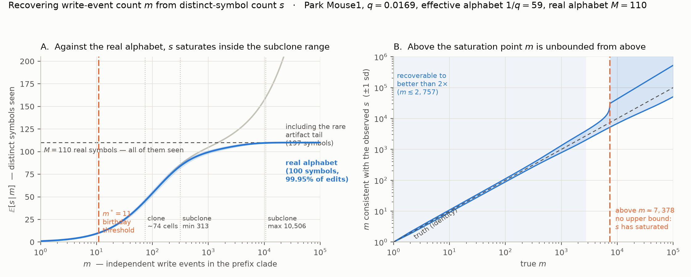
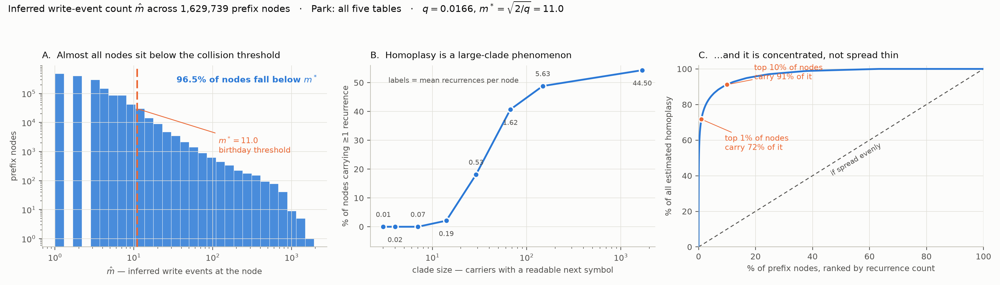
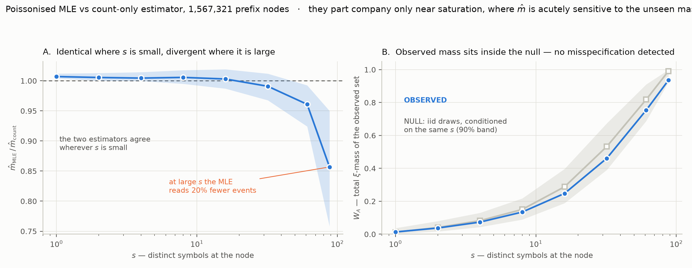

# park-compatibility

**Question.** Does Park's cross-tape character compatibility support the perfect-phylogeny route
(§D.4), and how big is the gap between the homoplasy prediction and the measurement?

**Answer.** *(open — Step 0 only)*

## What was run

- `src/01_symbol_composition.py` — streams all five edit tables, reports shape, missingness, the
  insertion alphabet, and $q=\sum_i \xi_i^2$. Output: `results/symbol_composition.json`.
- `src/02_alphabet_checks.py` — rarefaction of $M_{\rm obs}$, and per-site $q$ as a test of row A3.
  Output: `results/alphabet_checks.json`.
- `src/03_missing_pattern.py` — separates tape-dropout from unedited sites.
- `src/04_xi_vectors.py` — full $\xi$ vectors, global and per site. Output: `results/xi_vectors.json`.
- `src/05_coupon_identifiability.py` — $\mathbb{E}[s\mid m]$, $\mathrm{sd}[s\mid m]$, and the inversion.
  Outputs `results/coupon_identifiability.json`, `figures/coupon_identifiability.png`.
- `src/06_estimate_m.py` — count-only $\hat m$ per prefix node. `results/m_estimates_*.tsv.gz`.
- `src/07_m_figure.py` — `figures/m_distribution.png`.
- `src/08_poisson_mle.py` — **the set-dependent MLE, with the full derivation in its header**;
  MC validation + per-node estimates. `results/m_mle_*.tsv.gz`, `results/mle_validation.json`.
- `src/09_mle_vs_moment.py` — estimator comparison and the (corrected) model check.

## Findings

### Step 0 — the matrix is present and is what §D.4b needs

| table | cells | tapes | sites | missing | $M_{\rm obs}$ | edits | junk | $q$ | $1/q$ |
|---|---|---|---|---|---|---|---|---|---|
| Initial  | 37,810 | 166 | 6 | 62.2% | 244 | 13,892,618 | 2.47% | 0.016905 | 59.2 |
| Mouse1   | 12,232 | 166 | 6 | 51.2% | 197 |  5,809,280 | 2.36% | 0.017400 | 57.5 |
| Mouse2   |  6,899 | 166 | 6 | 50.0% | 184 |  3,339,410 | 2.72% | 0.017168 | 58.2 |
| Mouse3   |  2,904 | 166 | 6 | 53.2% | 167 |  1,322,277 | 2.29% | 0.017256 | 57.9 |
| Subclone | 39,606 | 166 | 6 | 42.7% | 218 | 22,116,803 | 2.22% | 0.016889 | 59.2 |

† *these `missing` figures pool tape-dropout with unedited sites — see the correction below.*

99,451 cells total. **166 tapes × 6 sites confirmed** against the notes' record of the design
(§1629 table), with a byte-identical tape-barcode set across all five tables — so the tables are
directly stackable and tape identity is consistent.

### ⚠⚠ $q$ is 4.3× the value assumed throughout the notes

$q\approx0.0170$, not the $\approx0.004$ that §D.4b and §1681 assume. The old figure took a flat
distribution over $M=256$; in fact only 167–244 symbols appear and the distribution is skewed
(top symbol `ATATGGA` = 4.4%), giving an **effective alphabet of ~58, not 256.**

This *inverts* the comparison to Mulberry: their "high diversity" benchmark is $q=1/64=0.0156$, so
Park is marginally **worse**, not "near homoplasy-free". Correction written into §D.4b.

**Consequence for this analysis:** the §D.4b null must be recomputed at $q=0.0170$ before the
predicted-vs-measured gap can be read as dropout/error. The residual framing is unaffected; the
subtrahend changes. Do this before running the compatibility check.

### Two data-handling facts the protocol has to absorb

1. **⚠ CORRECTED — the 43–62% "missingness" was two different things added together.**
   `None` marks both *tape not observed* and *site not yet edited*, and the Step-0 number pooled
   them. Decomposed on Mouse3 (482,064 cell×tape instances, `src/03_missing_pattern.py`):

   | | tape-instances | % of all entries |
   |---|---|---|
   | tape entirely absent (**true dropout**) | 212,802 (44.14%) | 44.14% |
   | observed tape, trailing unedited sites (**biology, not loss**) | — | 9.07% |
   | actual edits | — | 46.79% |

   Only 0.02% of tapes show an *internal* `None` (a gap with a symbol after it), so the sequential
   architecture is respected essentially perfectly — a strong sanity check on the whole dataset.

   ⇒ **True per-tape dropout is 44%, not 53%.** The other 9% is saturation, and it is informative
   data, not missing data. Step 4's missing-as-absent/missing-excluded split applies to the 44%
   only; treating unedited sites as "missing" would be a modelling error.

   ⚑ **Mean fill is 5.02 of 6 sites; 41.4% of observed tapes are completely full.** The recorder is
   heavily saturated in Mouse3 — relevant to dynamic range (§H.6.13) and to how much of the
   experiment the tapes actually witnessed.
2. **~2.3% of observed entries are not NNNNGGA** — 1,939 distinct malformed strings, lengths 1–132.
   The largest single class is 6-mers (21,244 in Mouse3), dominated by `CACGGA`, `GATGGA`,
   `GCGCGG` — consistent with truncation. **Undecided: drop these, or treat as a distinct
   observed state?** They are not missing data and silently coercing them to `None` would inflate
   the dropout estimate. Decide before Step 2.

### Sample structure

From `clonalbc_percell_hamming1_corrected.csv`'s `Sample` column, joined to the CellID suffixes:

| table | samples | reading |
|---|---|---|
| `Initial` | `Initial_1`, `Initial_2` | pre-transplant in vitro population, 2 replicates |
| `Mouse1` | `M1_LL`, `M1_LN`, `M1_TH`, `M1_LLL`, `M1_R`, `M1_IP` | one xenografted mouse, dissected by anatomical compartment |
| `Mouse2` | `M2_LV`, `M2_LL1`, `M2_LL2` | " |
| `Mouse3` | `M3_LL1`, `M3_LL2`, `M3_LV` | " |
| `Subclone` | `Subclone_1`, `Subclone_2` | the subclone arm, 2 replicates |

So the five tables are **experimental arms, not five clones** — `Mouse1/2/3` are the three
xenografted animals of Park, Chang et al., each split across harvest sites. The two-letter codes
are anatomical (LL/LLL lung, LN lymph node, LV liver, TH, R, IP) — **expansion inferred from
context, confirm against the paper before using in any writeup.**

⚑ Supporting evidence that `Initial` is the earliest timepoint: its site-6 occupancy is far lower
than the others ($n_6/n_1 = 5.1\%$, vs 38% Mouse1, 27% Subclone), i.e. the least tape saturation,
as expected for a pre-transplant sample.

### $M_{\rm obs}$ is mostly a sampling artefact — rarefaction

The tables differ 17-fold in edit count, so raw $M_{\rm obs}$ is not comparable.
Rarefied to Mouse3's 1,322,277 edits (`src/02_alphabet_checks.py`):

| table | edits | $M_{\rm obs}$ | $M$ @ rarefied |
|---|---|---|---|
| Initial | 13,892,618 | 244 | 201 |
| Mouse1 | 5,809,280 | 197 | 168 |
| Mouse2 | 3,339,410 | 184 | 163 |
| Mouse3 | 1,322,277 | 167 | 167 |
| Subclone | 22,116,803 | 218 | **157** |

The 167–244 spread narrows to 157–201, and the ordering changes — Subclone goes from second-highest
to lowest. **Do not read $M_{\rm obs}$ as a property of a sample.** $q$ is the robust statistic:
it varies by <3% across tables while $M_{\rm obs}$ varies by 46%.

### Row A3 partially fails across sites — site 6 has elevated $q$

$q$ per site (sites are ordered in time, so this is a direct test of A3):

| table | Site1 | Site2 | Site3 | Site4 | Site5 | Site6 |
|---|---|---|---|---|---|---|
| Initial | 0.01720 | 0.01688 | 0.01679 | 0.01662 | 0.01708 | **0.01773** |
| Mouse1 | 0.01807 | 0.01786 | 0.01748 | 0.01795 | 0.01874 | **0.02008** |
| Mouse2 | 0.01795 | 0.02024 | 0.01922 | 0.01848 | 0.01765 | **0.02290** |
| Mouse3 | 0.01752 | 0.01739 | 0.01726 | 0.01763 | 0.01740 | **0.01841** |
| Subclone | 0.01698 | 0.01869 | 0.01681 | 0.01806 | 0.01674 | **0.01806** |

Site 6 is the maximum in **all five** tables, 3–27% above the same table's minimum.

Not a small-sample artefact: the plug-in estimator has $\mathbb{E}[\hat q]=q+(1-q)/n$, so at
$n_6\approx10^5$–$2\times10^5$ the upward bias is $\approx5\times10^{-6}$ — three orders of
magnitude below the observed 0.001–0.005 elevation.

⇒ **$\xi$ is not constant across sites**, so the pooled Step-0 $\hat\xi$ is a
time-averaged quantity. The effect is modest (few %) and does not change the headline
$q\approx0.017$, but it means A3 is measurably violated in the direction that matters, and any
per-site homoplasy null should use the per-site $q$.

Edit counts fall monotonically $n_1>n_2>\dots>n_6$ in every table — the expected sequential-filling
signature, and a clean sanity check that the site ordering in the columns is real.

### Is $m$ recoverable from $s$? — yes, over the range that matters

$m$ (independent write events at a site within a prefix clade) is not observable; $s$ (distinct
symbols those events produced) is. They differ by exactly the homoplasy count, $m-s$, which is the
circularity. The way out is that the $m$ events are iid draws from $\xi$ (§1a.3), so

$$\mathbb{E}[s\mid m]=\sum_i\left(1-(1-\xi_i)^m\right)$$

is monotone in $m$ and invertible against the **measured** $\xi$. `src/05_coupon_identifiability.py`
computes this plus $\mathrm{sd}[s\mid m]$ (occupancy variance, incl. the negative cross-covariance)
and inverts the $\pm1$ sd band to get the recoverable interval $[m_{\rm lo},m_{\rm hi}]$.

**Both closed forms verified against Monte Carlo** (20,000 reps to $m$=2,574; 4,000 above) — $\mathbb{E}$
and sd agree to 3–4 significant figures at $m=5,11,74,313,2574,10506$.

| quantity | value |
|---|---|
| $m$ recoverable to better than 2× | $m \lesssim 1{,}199$ |
| $m$ has no upper bound above | $m \approx 5{,}997$ ($s$ saturated) |
| $m$ at half the alphabet | 89 |
| $m$ at 90% of the alphabet | 602 |
| $\mathbb{E}[s]$ at $m=74$ (clone size) | 44.9 |
| $\mathbb{E}[s]$ at $m=10{,}506$ (largest subclone) | 99.8 of 100 — saturated |

⇒ **Usable for the primary analysis unit.** §D.4b step 1 works within clones of ~74 cells, where
$m\le74$ sits comfortably below the resolution limit. It degrades in the largest subclones only,
where we fall back to the assumption-free bracket $s\le m\le n_L$.

### ⚑⚑ The real alphabet is ~100 symbols, not 256 — and the tail nearly fooled the estimator

Symbol counts in Mouse1 split cleanly:

| count band | # symbols | share of edits |
|---|---|---|
| >10,000 | 91 | 99.392% |
| 1,001–10,000 | 9 | 0.559% |
| 101–1,000 | 6 | 0.030% |
| 11–100 | 30 | 0.015% |
| 2–10 | 40 | 0.004% |
| 1 | 21 | 0.0004% |

**100 symbols carry 99.95% of all edits.** The other 97 carry <0.05% between them — rarest
$\xi=1.7\times10^{-7}$, i.e. seen *once* in 5.8 M edits. Those are sequencing artifacts that happen
to satisfy NNNNGGA, not real pegRNAs. So the design alphabet $M=256$ is not realised: the effective
pegRNA pool is ~100, with $1/q\approx57$ after skew.

⚠ **This tail is a trap for exactly this estimator.** Being rare, artifact symbols keep $s$ growing
long after the real alphabet is exhausted, so the untrimmed 197-symbol $\xi$ makes the inversion
*look* well-conditioned out to $m\sim10^6$. It isn't — that apparent resolution is entirely
manufactured by noise. Panel A of the figure shows both curves; the grey one is the illusion.
$q$ is unaffected (0.017400 untrimmed vs 0.017417 trimmed), which is again why $q$ is the robust
statistic and symbol *counts* are not.

### First pass: $\hat m$ per prefix node — homoplasy is rare, and concentrated

`src/06_estimate_m.py` walks the prefix trie within each clonal barcode, per tape, and records
$s$ and the clade size at every node; `src/07_m_figure.py` summarises. **1,567,321 nodes** with
≥3 carriers across all five tables.

One alphabet rule used consistently for both $\xi$ and $s$: a value is a symbol iff it matches
NNNNGGA **and** occurs ≥1,000 times in its table (~94–106 symbols, 99.7–99.97% of edits).
Anything else — scaffold read-through, indel variants, the rare tail — truncates the prefix.

**1. 95.8% of nodes sit below the birthday threshold** $m^\ast=\sqrt{2/q}=10.8$. Median $s$ is 1–3
almost everywhere: the carriers of a prefix overwhelmingly share *one* next symbol, which is the
single-origin behaviour a perfect phylogeny predicts.

**2. Homoplasy scales with clade size, as the mechanism predicts** — mean recurrences per node:

| clade size | 3 | 4–5 | 6–10 | 11–20 | 21–50 | 51–100 | 101–500 | >500 |
|---|---|---|---|---|---|---|---|---|
| mean recurrences | 0.01 | 0.02 | 0.07 | 0.20 | 0.53 | 1.65 | 5.75 | **50.49** |
| % of nodes with ≥1 | 0.0 | 0.0 | 0.0 | 2.0 | 18 | 41 | 49 | **55** |

⚠ This is *consistency*, not independent confirmation: $\hat m - s$ and $\binom{m}{2}q$ are related
by construction, since $\mathbb{E}[s\mid m]=m-\mathbb{E}[\text{collisions}]$. What is genuinely
informative is the **clade-size dependence**, which the estimator does not build in.

**3. ⚑⚑ It is concentrated, which is the answer §D.4b step 5 wanted.** Ranking nodes by recurrence
count: the **top 1% carry 73%** of all estimated homoplasy, the top 10% carry 92%. Per §D.4b's
decision rule that is the *easy* world — conflict that can be removed by deleting a small set of
characters, rather than conflict spread thin enough to make maximal-compatible-set genuinely hard.

**4. The arms differ enormously, and it is all clade size.** Level-0 nodes (site 1, whole clone):

| table | median clade | mean recurrences | % nodes with ≥1 |
|---|---|---|---|
| Mouse1/2/3 | 7–8 | 0.03–0.11 | 0.4–1.1% |
| Initial | 9 | 0.22 | 5.4% |
| Subclone | **933** | **16.0** | **40.8%** |

The subclone arm is where homoplasy lives, and it is there because subclones were *designed* to be
large. The metastasis mice are essentially homoplasy-free at the clade sizes they actually have.

### ⚠ Two data facts that complicate the per-clone protocol

**Clone sizes do not match the notes.** §1629 records "~74 cells/clone × 75 clones". The delivered
`ClonalBC` column has **3,294 distinct barcodes, median 7 cells, max 27,537**, with five clones
holding 50% of all cells. Whatever the "75 clones" refers to, it is not this column as delivered —
resolve before per-clone results are quoted against the paper.

**Clone-barcode dropout is substantial and uneven**: cells skipped for lacking a `ClonalBC` are
2,239/37,810 (5.9%) in Initial, 670/39,606 (1.7%) in Subclone, but **5,489/12,232 (44.9%) in
Mouse1**, 1,511/6,899 (21.9%) Mouse2, 970/2,904 (33.4%) Mouse3. The mouse arm loses a third to a
half of its cells before the analysis starts.

### Second pass: the Poissonised MLE — implemented, validated, run

The current estimator uses only $|A|=s$, discarding *which* symbols were seen. It shouldn't: the
likelihood of observing set $A$ in $m$ draws is
$P(A\mid m)=\sum_{B\subseteq A}(-1)^{|A|-|B|}W_B^{\,m}$ with $W_B=\sum_{i\in B}\xi_i$, which depends
on the mass of $A$, not just its size. A rare-symbol $A$ implies $\hat m\to s$; a common-symbol $A$
tolerates much larger $\hat m$.

Poissonising the draw count makes the symbols independent and the likelihood exact and tractable:

$$\ell(m)=\sum_{i\in A}\log\!\left(1-e^{-m\xi_i}\right)\;-\;m\!\!\sum_{i\notin A}\!\xi_i$$

The second term is the set-dependent penalty: large $m$ is punished in proportion to the mass
**not** observed. Full derivation — inclusion–exclusion, the Poissonisation step, concavity, the
saturation limit — is documented in the header of `src/08_poisson_mle.py`.

**Monte-Carlo validated against the true fixed-$m$ model** (`results/mle_validation.json`):

| true $m$ | mean $s$ | MLE bias / IQR | count-only bias / IQR |
|---|---|---|---|
| 5 | 4.8 | +4.1% / 2.3% | +3.7% / 0.0% |
| 50 | 34.8 | +0.6% / 14.2% | +0.7% / 16.8% |
| 200 | 71.5 | +0.5% / **17.6%** | −1.8% / 21.0% |
| 500 | 87.9 | +1.6% / **26.4%** | −0.1% / 35.0% |

Both estimators are near-unbiased, so Poissonisation costs ≤1.6% bias. The MLE's gain is
**variance**: 16% narrower IQR at $m=200$, 25% narrower at $m=500$. It is no better below $m\approx10$.

**On the data** (`src/09_mle_vs_moment.py`, all 1,567,321 nodes):

| $s$ | nodes | $\hat m_{\rm MLE}/\hat m_{\rm count}$ |
|---|---|---|
| 1–25 | 1,559,225 (99.5%) | 1.003–1.007 |
| 26–50 | 6,211 | 0.989 |
| 51–80 | 1,474 | 0.950 |
| 81–120 | 411 | **0.799** |

Identical where $s$ is small — as predicted, since $(1-W_A)\approx1$ there whatever was seen — and
divergent only near saturation, where $\hat m$ scales roughly as $1/(1-W_A)$ and is therefore acutely
sensitive to the observed mass that the count-only estimator throws away.

⚠ **A trap worth recording.** The first version of the model check compared observed $W_A$ against
$\mathbb{E}[W_A\mid m]$ at the $m$ implied by $s$, and appeared to show a large-$s$ deficit — i.e.
model misspecification. That was an artifact: the data are selected on $s$, not $m$, and for fixed
$m$ a node reaching an unusually large $s$ got there by hitting unusually many *rare* symbols, which
depresses $W_A$. Conditioning the null on the realised $s$ instead (by simulation), **observed $W_A$
falls inside the 90% band at every $s$** — no misspecification detected. Panel B shows the corrected
comparison.

**Effect on the conclusions: none qualitatively.**

| | below $m^\ast$ | total recurrences | top 1% holds | top 10% |
|---|---|---|---|---|
| count-only | 95.82% | 629,428 | 73.1% | 91.6% |
| Poissonised MLE | 96.01% | 574,959 | 65.0% | 86.9% |

Homoplasy is 8.7% lower and slightly less concentrated, but the picture — overwhelmingly
sub-threshold, strongly concentrated — is unchanged. **Use the MLE numbers going forward**; it is
the more efficient estimator and costs nothing where the two agree.

### ⚠⚠ CORRECTION — junk values ARE heritable characters; the alphabet rule is wrong

Scripts 06–10 treat any non-NNNNGGA value as junk that truncates the prefix, on the grounds that
`CACGGA` occurs 47,287 times and would "manufacture false clades" if admitted. **That reasoning
assumed its own conclusion**, and the data contradict it (`src/11_junk_heritability.py`).

Two hypotheses, opposite predictions, no tree required. A *heritable* insertion at site $k$ of tape
$z$ arose once in an ancestor, so its carriers must share that ancestor's sites $1..k-1$ and sit in
one clone. A *readout artifact* lands on unrelated cells.

**Test 1 — preceding-prefix concordance** (median, Mouse1, matched on carrier count):

| carriers | 3–4 | 5–9 | 10–24 | 25–99 | 100–499 | 500+ |
|---|---|---|---|---|---|---|
| real symbols | 0.500 | 0.400 | 0.348 | 0.408 | 0.515 | 0.945 |
| junk values | **1.000** | **0.667** | **0.524** | **0.714** | **0.880** | **0.980** |

**Test 2 — clone restriction** (triples with ≥10 carriers):

| | n | top-clone share | top-sample share | clone/sample ratio |
|---|---|---|---|---|
| junk | 1,356 | **0.681** | 0.856 | **0.857** |
| real symbols | 50,813 | 0.456 | 0.783 | 0.625 |
| random cells (null) | — | 0.16–0.20 | — | — |

**Junk is *more* clone-restricted than real symbols**, and far above the random null. The
library-artifact confound is excluded: if junk arose per sequencing run it would be sample-restricted
but *not* clone-restricted, giving a low clone/sample ratio — instead junk's ratio (0.857) is
*higher* than real symbols' (0.625). The top junk triples carry 1,200–1,600 cells spread over ~50
clones with **92–96% in a single clone** — one ancestral event plus a small leakage tail.

Why *more* restricted than real symbols? Junk events are rarer per (tape, site), so fewer independent
origins, so each occurrence traces to one ancestor. That is what a rare heritable event looks like.
It is also mechanistically expected: pegRNA scaffold read-through physically writes scaffold sequence
into the tape, and once written it is as irreversible as any designed insertion.

⇒ **Change the alphabet rule to frequency alone: a value is a symbol iff it occurs ≥1,000 times in
its table.** Drop the NNNNGGA pattern requirement — frequency is the evidence of reality; conformance
to the design pattern is not required, and demanding it discards real heritable events. This is the
same threshold already applied to NNNNGGA symbols (which it uses to exclude ~97 rare artifacts).

Impact on Mouse1: 9 junk values promoted (`CACGGA` 25,757, `GATGGA` 12,294, `GCGCGG` 11,107, four
scaffold read-through variants, `TTTTGGGA`, `TTTTAGGA`), recovering **71.6% of junk edits** directly
plus the **3.03% of downstream symbols** previously lost to truncation. Nearly free in $q$:

| | alphabet | $q$ | $1/q$ |
|---|---|---|---|
| current rule | 100 | 0.017417 | 57.4 |
| frequency-only rule | 109 | 0.017104 | 58.5 |

**Confirmed independently on Subclone** (`src/12_junk_check_table.py`), against a null calibrated
per table — Subclone has 15 clones with one holding 28% of cells, so its random-cell baseline is
0.290 versus Mouse1's 0.238:

| table | | top-clone | null | **excess** | clone/sample |
|---|---|---|---|---|---|
| Subclone (15 clones) | junk | 0.727 | 0.290 | **+0.436** | 1.263 |
| | real | 0.583 | 0.286 | +0.295 | 1.049 |
| Mouse1 (296 clones) | junk | 0.681 | 0.238 | **+0.444** | 0.857 |
| | real | 0.456 | 0.239 | +0.222 | 0.625 |

Junk excess is +0.44 on both tables against different nulls and different clone structures.

**✅ APPLIED 2026-08-31.** Script 04 now counts every value and keeps those with ≥1,000 occurrences;
scripts 05–10 rerun. Alphabet 97–129 symbols per table (was 94–106), 3–23 promoted non-NNNNGGA
symbols carrying 1.6–2.3% of kept edits.

| | old rule | new rule |
|---|---|---|
| mean $q$ | 0.0172 | **0.016641** |
| birthday $m^\ast$ | 10.8 | 10.96 |
| prefix nodes | 1,567,321 | 1,629,739 |
| below $m^\ast$ (MLE) | 96.01% | **96.25%** |
| top 1% of nodes hold | 65.0% | **64.9%** |
| top 10% hold | 86.9% | **86.9%** |
| characters ≥3 carriers | 1,729,592 | **1,801,071** |
| $m$ recoverable to 2× | $m\lesssim1{,}199$ | **$m\lesssim2{,}757$** |

**Nothing qualitative moved.** $q$ falls 3%, so homoplasy becomes marginally *less* likely, and the
concentration result — the one the whole "conflict is removable" conclusion rests on — is unchanged
to within 0.1 points. We gain 4.1% more characters and materially better $m$-identifiability
(a larger real alphabet means $s$ saturates later). The corrected $W_A$ model check still finds
observed mass inside the null band at every $s$.

⚠ Scripts 01–03 predate this rule and still describe the NNNNGGA-only alphabet; they are kept as the
Step-0 record, and the $q\approx0.0174$ quoted in §D.4b CORRECTION 1 is the old-rule value.

### Step 4 — the compatibility check, first table (Mouse3, complete)

`src/13_compatibility.py` is the reference cross-tab engine (verified against explicit brute-force
set operations on real clones, both conventions). `src/14_compat_sparse.py` is the production
engine: the same computation recast as two sparse products,

$$n_{11}=(MM^\top)_{ij},\qquad n_{10}=(MN^\top)_{ij}-n_{11},\qquad n_{01}=(MN^\top)_{ji}-n_{11}$$

with $M$ = characters × cells membership and $N$ = characters × cells determination. Only the
non-zero entries of $MM^\top$ are materialised, so disjoint pairs are counted by subtraction and
never touched. Verified against script 13; **5× faster and it reaches the large clones script 13
could not** (91/91 Mouse3 clones in 560 s vs 63/91 in 915 s).

**Mouse3, all 91 clones, 55,875 characters, 1,856 cells:**

| convention | pairs | incompatible | compatibility |
|---|---|---|---|
| missing-as-absent | 27,368,822 | 9,972,354 | **63.56%** |
| missing-excluded | 27,368,822 | 1,462,105 | **94.66%** |
| | | | **spread +31.09 points** |

By clone size (missing-excluded / as-absent / spread):

| cells | clones | as-absent | excluded | spread |
|---|---|---|---|---|
| 3–4 | 24 | 87.32% | 99.81% | +12.49 |
| 5–10 | 28 | 69.74% | 98.58% | +28.84 |
| 11–20 | 18 | 53.94% | 96.36% | +42.43 |
| 21–300 | 21 | 63.62% | 93.52% | +29.90 |

**Reading 1 — dropout is the binding constraint.** A 31-point spread is the last row of §D.4b's
decision rule: *"dropout is the binding constraint, which is row **A6**, and argues for the SBI
route."* The spread widens with clone size, because more cells give more chances for a dropped-out
cell to fake a witness in $S_1\setminus S_2$. It also vindicates building $D$: the naive convention
reports 63.56% and would have condemned the perfect-phylogeny route outright.

**Reading 2 — 94.66% sits in the 80–95% band**, "live but needs conflict resolution", just under the
≳95% threshold for the easy verdict.

⚠ **Reading 3 — conflict was NOT concentrated, unlike homoplasy.** In the crashed session's run the
conflict graph had ~58% of characters carrying at least one conflict, with the top 10% holding only
~46% of edges — against homoplasy's top 1% holding 65%. If that holds, it is the *"spread thin"*
world of §D.4b step 5, where maximal-compatible-set is genuinely hard. **These degree numbers were
printed but never written to disk and are lost**; `src/14` now persists them
(`results/conflict_degrees_{table}.npz`) and Mouse3 must be rerun to recover them.

**Caveat on all of the above:** Mouse3 is the smallest table — median clone 4 cells, largest 210.
The size trend suggests larger clones will score lower. Mouse1, Mouse2, Initial, Subclone not yet run.

### ⚠⚠ $C$ is not yet measured — and the obvious route to it is invalid

Computing $C$ from the conflict-free characters of the missing-excluded run gave
$C/(n-1)=\mathbf{2.107}$ — impossible — with laminarity failing on 37,737 pairs. Diagnosis in
§D.4d: **missing-excluded compatibility is pair-specific** (each pair is laminar on its own
$D_1\cap D_2$), so it does not compose into the single laminar family a tree requires.

⇒ $C$ must come from the **missing-as-absent** graph, where compatibility does imply laminarity.
`src/14` currently saves degrees only for the excluded convention; it needs to save both, then rerun.
`src/16_skeleton_C.py` is correct machinery pointed at the wrong input.

⇒ Reframes the spread: 94.66% is what we *would* see with complete data; **63.56% is what a skeleton
can actually be built from.** Only the pessimistic end is constructible.

### Verdict so far, against §D.4b's decision rule

| signal | Mouse3 | reading |
|---|---|---|
| compatibility (excluded) | 94.66% | 80–95% band: "live but needs conflict resolution" |
| compatibility (as-absent) | 63.56% | below the <80% "different project" line |
| spread | **+31.09 pts** | **dropout is the binding constraint — row A6** |
| conflict concentration | top 10% hold 45.9% | **"spread thin"** — max-compatible-set is genuinely hard |
| $C$ | **not measured** | the question is not answered until it is |

⚠ Mouse3 is the *most favourable* table: compatibility falls monotonically with clone size (99.81%
at 3–4 cells → 93.52% at 21–300), and its largest clone is 210 cells against Subclone's 10,997.

## Caveats

- $\hat m$ is capped at the clade size (correct: $m\le n_{\rm next}$) and floored at $s$. The cap
  is not binding at the largest nodes observed, so it is not distorting the tail.
- The $m$-identifiability result uses Mouse1's $\xi$; the other tables' $q$ agree to <3% so it
  should transfer, but it has not been recomputed per table.
- $q$ pooled over all **tapes** (per-tape breakdown not yet done — a per-tape $\xi$ would test
  the rest of row A3, and bears on the *cis*-preference question at §1312).
- Clone structure not yet joined in — all numbers above are per *table*, not per clone.
